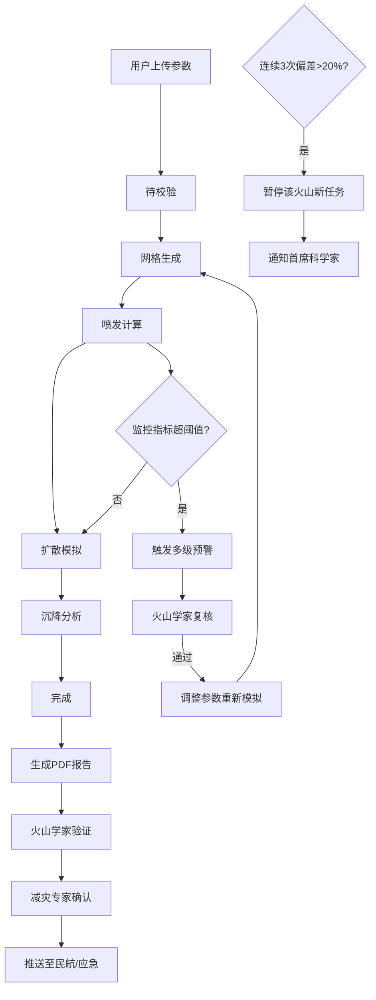

## 1. 产品概述

高精度火山喷发动力学模拟与火山灰扩散智能预警平台，面向火山学家、减灾专家、民航及应急管理部门，提供从火山地形建模、多相流数值模拟到智能预警推送的全流程解决方案。

- 核心价值：通过高精度三维多相流模型模拟火山喷发全过程，实时监测关键指标并自动触发多级预警，提升灾害响应效率
- 目标用户：火山学家、减灾专家、民航管理部门、应急管理部门、首席科学家

## 2. 核心功能

### 2.1 用户角色

| 角色 | 注册方式 | 核心权限 |
|------|----------|----------|
| 系统管理员 | 后台创建 | 用户管理、系统配置、全局统计 |
| 火山学家 | 邮箱注册 | 创建模拟任务、参数调整、复核预警、验证动力学结果 |
| 减灾专家 | 邮箱注册 | 确认预警等级、审批模拟结果 |
| 首席科学家 | 后台创建 | 处理异常偏差告警、暂停/恢复火山任务 |
| 民航/应急部门 | 授权接入 | 接收预警推送、查看报告和风险等级 |

### 2.2 功能模块

1. **综合看板页**：实时统计概览、模拟完成率趋势图、预警提前量、预测精度、活跃任务列表
2. **模拟任务创建页**：上传DEM数据、岩浆成分参数配置、喷发源参数设置、智能参数推荐
3. **任务管理列表页**：任务状态流转、进度监控、筛选搜索、批量操作
4. **实时监控预警页**：喷发柱高度实时曲线、火山灰浓度热力图、热辐射通量监控、预警推送、专家复核
5. **报告与数据导出页**：综合PDF报告预览、喷发柱演化曲线、浓度等值面、热辐射云图、沉降厚度图、航空风险图、全场数据导出
6. **审批流程页**：两级审批（火山学家验证 + 减灾专家确认）、审批历史、调整日志
7. **异常偏差告警页**：连续偏差检测、任务暂停管理、首席科学家处理

### 2.3 页面详情

| 页面名称 | 模块名称 | 功能描述 |
|----------|----------|----------|
| 综合看板 | 统计概览卡片 | 展示总任务数、完成率、预警次数、平均预测精度 |
| 综合看板 | 性能趋势图 | 折线图展示30天内模拟完成率、预警提前量、预测精度趋势 |
| 综合看板 | 活跃任务列表 | 展示正在运行的模拟任务及当前状态、进度百分比 |
| 综合看板 | 最新预警列表 | 展示最近触发的预警信息及处理状态 |
| 任务创建 | DEM上传区 | 支持GeoTIFF/ASCII格式的火山地形DEM文件上传与预览 |
| 任务创建 | 岩浆成分配置 | SiO₂、Al₂O₃、FeO、MgO、CaO等氧化物含量百分比输入 |
| 任务创建 | 喷发源参数 | 喷口直径、初始压力、温度、H₂O/CO₂/SO₂气体含量配置 |
| 任务创建 | 智能推荐引擎 | 基于历史模拟推荐最优喷发参数组合 |
| 任务列表 | 状态流转时间线 | 可视化展示"待校验-网格生成-喷发计算-扩散模拟-沉降分析-完成-异常回退"全流程 |
| 任务列表 | 任务筛选 | 按火山名称、状态、时间范围、强度等级筛选 |
| 实时监控 | 喷发柱高度曲线 | 实时动态折线图，平流层阈值线标记，超阈值高亮告警 |
| 实时监控 | 火山灰浓度分布 | 三维等值面可视化，航空安全阈值标注 |
| 实时监控 | 热辐射通量云图 | 二维热力图展示热辐射空间分布 |
| 实时监控 | 多级预警推送 | 触发预警后推送至火山学家，支持快速复核操作 |
| 报告预览 | PDF报告组件 | 喷发柱高度演化曲线、火山灰浓度等值面、热辐射云图、沉降厚度图、航空风险等级图 |
| 报告预览 | 数据导出 | 按喷发强度、大气条件、时间窗口导出全场数据（CSV/NetCDF） |
| 审批流程 | 两级审批面板 | 火山学家动力学验证、减灾专家预警等级确认 |
| 审批流程 | 调整日志 | 记录每次参数调整内容、调整人、调整时间、调整原因 |
| 异常告警 | 偏差检测面板 | 显示同一火山连续三次模拟的喷发柱高度偏差值 |
| 异常告警 | 任务暂停管理 | 自动暂停超偏差火山的新任务，支持首席科学家恢复 |

## 3. 核心流程

用户上传火山地形DEM、岩浆成分和喷发源参数 → 系统自动构建三维多相流模型并生成自适应网格 → 模拟任务按状态自动流转（待校验→网格生成→喷发计算→扩散模拟→沉降分析→完成）→ 实时监控喷发柱高度、火山灰浓度、热辐射通量 → 超阈值自动触发多级预警 → 火山学家复核 → 复核通过自动调整参数重新模拟并记录日志 → 模拟完成生成综合PDF报告 → 两级审批（火山学家验证→减灾专家确认）→ 通过后推送至民航和应急部门 → 每日统计生成综合看板

## 4. 用户界面设计

### 4.1 设计风格

- **主色调**：深空蓝 #0A1628（背景）、熔岩橙 #FF6B35（告警/强调）、数据青 #00D4AA（正常状态）
- **辅助色**：警示黄 #F4C430（预警）、危险红 #E63946（严重告警）、中性灰 #6B7280
- **按钮风格**：圆角8px，深色背景配亮色边框，hover状态发光效果
- **字体**：标题使用 Space Grotesk Bold，正文使用 JetBrains Mono Regular，数据展示使用 IBM Plex Mono
- **布局风格**：深色科技仪表盘风格，卡片式布局，网格背景纹理，数据可视化区域突出
- **图标风格**：Lucide React 线性图标，配霓虹发光效果

### 4.2 页面设计概览

| 页面名称 | 模块名称 | UI元素 |
|----------|----------|--------|
| 综合看板 | 统计卡片 | 渐变背景、发光边框、大字号数据展示、趋势箭头 |
| 综合看板 | 趋势图表 | 深色背景图表、彩色折线、渐变填充区域、网格线 |
| 任务创建 | 表单区域 | 分组卡片、标签页切换、数值滑块、实时预览 |
| 任务创建 | 文件上传 | 拖拽上传区、文件名预览、进度条、缩略图 |
| 任务列表 | 状态时间线 | 垂直时间线、彩色状态节点、进度条动画 |
| 实时监控 | 监控大屏 | 全屏网格布局、实时数据流、告警闪烁动画 |
| 实时监控 | 3D可视化 | Three.js三维场景、可交互旋转、等值面渲染 |
| 报告预览 | PDF组件 | 页面缩略图侧边栏、主预览区、工具栏 |
| 审批流程 | 审批面板 | 左右分栏、左侧任务详情、右侧审批操作 |

### 4.3 响应式

- 桌面端优先（≥1440px）：多栏网格布局，完整数据大屏展示
- 平板端（1024-1439px）：双栏布局，部分图表简化
- 移动端（<1024px）：单栏布局，核心功能优先，图表可横向滚动

### 4.4 3D场景指导

- **环境**：深色太空背景，微弱网格地面，模拟科学计算可视化环境
- **光照**：多光源配置，主光源冷白色，辅光源橙红色模拟火山光
- **相机**：透视相机，支持轨道控制器自由旋转缩放
- **组成**：火山地形DEM三维重建、喷发柱粒子系统、火山灰浓度等值面半透明渲染
- **交互**：鼠标拖拽旋转、滚轮缩放、点击选中区域查看数据
- **后期处理**：辉光效果（Bloom）、环境光遮蔽（AO）、色彩分级
