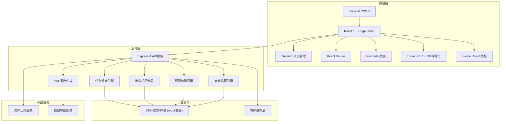
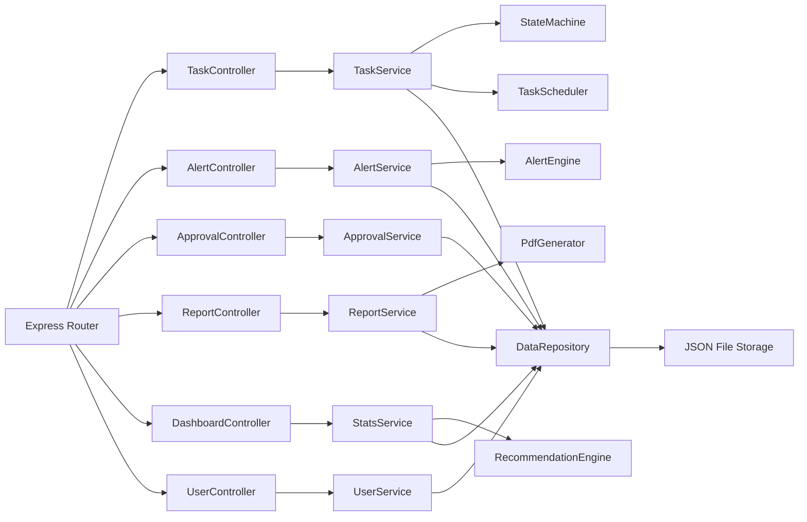
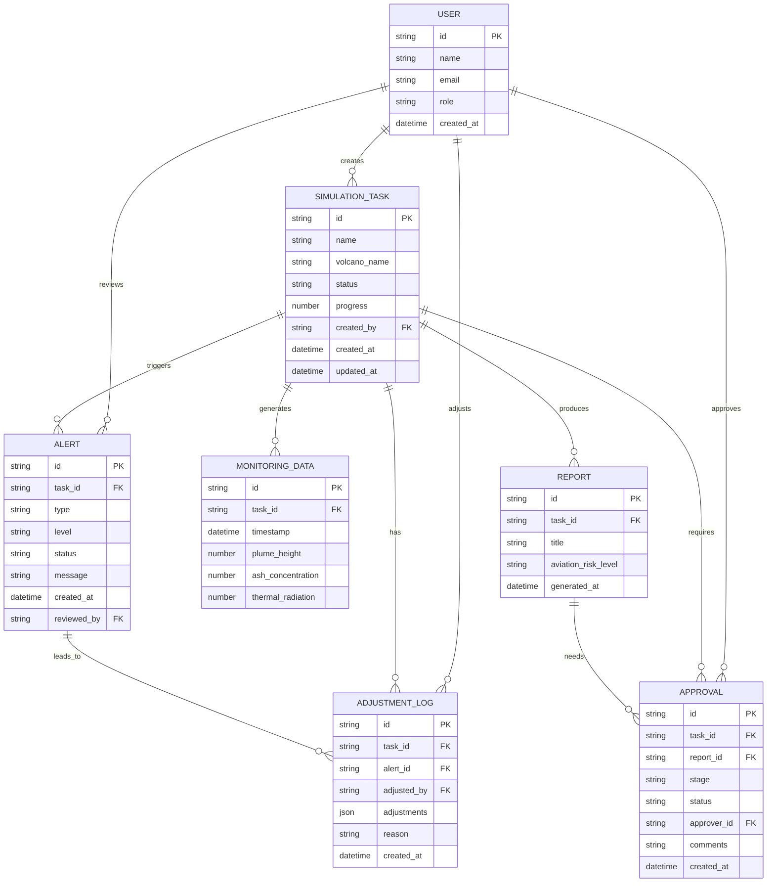

## 1. 架构设计



## 2. 技术描述

- **前端**: React@18 + TypeScript + Vite + Tailwind CSS@3 + Zustand + React Router@6 + Recharts + @react-three/fiber + @react-three/drei + lucide-react
- **初始化工具**: vite-init (react-express-ts模板)
- **后端**: Express@4 + TypeScript
- **数据库**: 使用JSON文件进行mock数据存储，模拟真实数据库操作
- **3D可视化**: three.js + @react-three/fiber + @react-three/drei + @react-three/postprocessing
- **图表**: Recharts
- **状态管理**: Zustand
- **PDF生成**: 服务端模拟PDF报告生成

## 3. 路由定义

| 路由 | 页面用途 |
|------|----------|
| /dashboard | 综合看板 - 统计概览、性能趋势、活跃任务、最新预警 |
| /tasks | 任务管理列表 - 全部模拟任务、状态筛选、搜索 |
| /tasks/create | 新建模拟任务 - DEM上传、参数配置、智能推荐 |
| /tasks/:id | 任务详情 - 状态时间线、实时监控、参数详情 |
| /monitor | 实时监控大屏 - 喷发柱高度、浓度分布、热辐射、预警 |
| /reports | 报告中心 - PDF报告列表、预览、数据导出 |
| /reports/:id | 报告详情 - 报告预览、下载、数据导出 |
| /approvals | 审批中心 - 待审批列表、两级审批操作 |
| /alerts | 异常告警 - 偏差检测、任务暂停管理 |
| /settings | 系统设置 - 用户管理、参数配置 |

## 4. API定义

```typescript
// 用户相关
interface User {
  id: string;
  name: string;
  email: string;
  role: 'admin' | 'volcanologist' | 'mitigation_expert' | 'chief_scientist' | 'aviation';
  avatar?: string;
  createdAt: Date;
}

// 模拟任务相关
interface MagmaComposition {
  sio2: number;      // SiO₂ %
  al2o3: number;     // Al₂O₃ %
  feo: number;       // FeO %
  mgo: number;       // MgO %
  cao: number;       // CaO %
  na2o: number;      // Na₂O %
  k2o: number;       // K₂O %
}

interface EruptionSourceParams {
  ventDiameter: number;       // 喷口直径 (m)
  initialPressure: number;    // 初始压力 (MPa)
  initialTemperature: number; // 初始温度 (°C)
  h2oContent: number;         // H₂O含量 (wt%)
  co2Content: number;         // CO₂含量 (wt%)
  so2Content: number;         // SO₂含量 (wt%)
}

type TaskStatus = 'pending_verification' | 'mesh_generation' | 'eruption_calculation' | 'diffusion_simulation' | 'settlement_analysis' | 'completed' | 'error_fallback';

interface SimulationTask {
  id: string;
  name: string;
  volcanoName: string;
  demFile?: {
    name: string;
    size: number;
    path: string;
  };
  magmaComposition: MagmaComposition;
  eruptionParams: EruptionSourceParams;
  status: TaskStatus;
  progress: number;
  createdBy: string;
  createdAt: Date;
  updatedAt: Date;
  currentStageStartTime: Date;
  deviationFlag?: boolean;
}

// 监控数据相关
interface MonitoringData {
  taskId: string;
  timestamp: Date;
  plumeHeight: number;         // 喷发柱高度 (km)
  ashConcentration: number;    // 火山灰浓度 (mg/m³)
  thermalRadiation: number;    // 热辐射通量 (W/m²)
}

// 预警相关
type AlertLevel = 'info' | 'warning' | 'danger' | 'critical';
type AlertStatus = 'pending_review' | 'reviewed' | 'adjusted' | 'ignored';

interface Alert {
  id: string;
  taskId: string;
  type: 'plume_height' | 'ash_concentration' | 'thermal_radiation';
  level: AlertLevel;
  message: string;
  threshold: number;
  actualValue: number;
  status: AlertStatus;
  createdAt: Date;
  reviewedBy?: string;
  reviewedAt?: Date;
  reviewNote?: string;
}

// 参数调整日志
interface AdjustmentLog {
  id: string;
  taskId: string;
  alertId: string;
  adjustedBy: string;
  adjustments: Partial<EruptionSourceParams>;
  reason: string;
  createdAt: Date;
}

// 审批相关
type ApprovalStatus = 'pending' | 'approved' | 'rejected';

interface Approval {
  id: string;
  taskId: string;
  reportId: string;
  stage: 'volcanologist_validation' | 'mitigation_confirmation';
  status: ApprovalStatus;
  approverId: string;
  approverRole: string;
  comments: string;
  createdAt: Date;
  decidedAt?: Date;
}

// 报告相关
interface Report {
  id: string;
  taskId: string;
  title: string;
  summary: string;
  plumeHeightChart: MonitoringData[];
  ashDistribution: any[];
  thermalRadiationMap: any[];
  settlementThickness: any[];
  aviationRiskLevel: 'low' | 'medium' | 'high' | 'severe';
  generatedAt: Date;
  generatedBy: string;
}

// 统计数据
interface DashboardStats {
  totalTasks: number;
  completionRate: number;
  totalAlerts: number;
  averageAccuracy: number;
  activeTasks: number;
  averageLeadTime: number;
  dailyTrend: Array<{
    date: string;
    completionRate: number;
    leadTime: number;
    accuracy: number;
  }>;
}

// API 路由定义
// GET    /api/users                 - 获取用户列表
// POST   /api/tasks                 - 创建模拟任务
// GET    /api/tasks                 - 获取任务列表
// GET    /api/tasks/:id             - 获取任务详情
// PUT    /api/tasks/:id/status      - 更新任务状态
// GET    /api/tasks/:id/monitoring  - 获取任务监控数据
// GET    /api/alerts                - 获取预警列表
// POST   /api/alerts/:id/review     - 复核预警
// GET    /api/approvals             - 获取审批列表
// POST   /api/approvals/:id/decide  - 审批决策
// GET    /api/reports               - 获取报告列表
// GET    /api/reports/:id           - 获取报告详情
// GET    /api/dashboard/stats       - 获取看板统计数据
// POST   /api/recommend/params      - 智能参数推荐
// GET    /api/alerts/deviations     - 获取偏差告警
```

## 5. 服务端架构图



## 6. 数据模型

### 6.1 数据模型ER图



### 6.2 数据初始化

系统启动时自动初始化以下mock数据：
- 5个用户（各角色各1-2个）
- 10个模拟任务（覆盖不同状态）
- 50条监控数据记录
- 8条预警记录
- 5条审批记录
- 3份报告
- 30天的统计趋势数据
